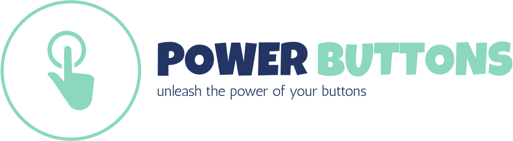

# PowerButtons
   

This is a library that adds additional functionality to buttons (or any other html component) in a web page. The idea is to simplify some tasks that we usually do in web pages, such as adding a confirmation dialog prior to submitting a form, or verifying that some condition is met prior to executing a function.

The library adds the following types of buttons:
1. _verify_ button that verifies that one condition is valid prior to executing the function that it should execute. And if the condition is not met, show a modal dialog to inform the user and interrupt its action. It is useful for (e.g.) form verification. ([see details](#verify-button))
1. _confirm_ button that makes that a button shows a confirmation modal dialog prior to executing the function that it should execute. It is useful for (e.g.) confirm the action of submitting a form or deleting entries in a database. ([see details](#confirm-button))
1. _asynctask_ button that executes an asynchronous task prior to executing its real action, and will show a modal dialog while it is being executed. It is useful for (e.g.) executing a long task prior to submitting a form. ([see details](#asynctask-button))
1. _showmessage_ button, that shows a modal dialog with a message prior to executing its real action. It is useful for (e.g.) showing the user a message when he is submitting a form. ([see details](#showmessage-button))
1. _formset_ button, that sets the values of a form fields prior to executing its real action. It is useful for (e.g.) setting a hidden field in a form prior to submitting it, or pre-filling a form. ([see details](#formset-button))
1. _formbutton_ button, that substitutes the button by a form that will contain the button. It can also add hidden fields to the form, to be submitted along with the button. It is useful to avoid the need of creating unnecessary forms in the html code. ([see details](#formbutton-button))

The most simple example is the next one:

```html
<button data-confirm="Are you sure?">clickme</button>
```

Then, when the button is clicked, a modal dialog such as the next one will be shown.


But it is possible to create more complex workflow such as in the next example:

```html
<form name="fullexampleform" method="get">
    <input type="text" name="name" class="form-control" placeholder="User name">
    <input type="text" name="email" class="form-control" placeholder="User email">
    <input type="hidden" name="payload" value="">
    <button type="button" class="btn btn-primary" 
        data-verify="this.name.value != '' && this.email.value != ''" 
        data-verify-form="fullexampleform"
        data-verify-not-verified="please fill all the fields" 
        data-confirm="are you sure you want to submit this form?" 
        data-showmessage="thank you for submitting the form" 
        data-formset="fullexampleform" data-formset-payload="javascript:JSON.stringify({name: this.name.value, email: this.email.value})">submit</button>
</form>
```

In this example we have a form. When the user submits it...

1. the button verifies that the fields `name` and `email` are not empty. If they are empty, a modal dialog is shown to the user with the message _please fill all the fields_. 
2. If the fields are not empty, a confirmation dialog is shown to the user with the message _are you sure you want to submit this form?_. 
3. If the user confirms, a message dialog is shown to the user with the message _thank you for submitting the form_. 
4. And finally, the values of the fields `name` and `email` are set in the hidden field `payload` in the form
5. ...and the form is submitted (it was its first purpose).

And we did all this without writing a single line of javascript code except for the validation and the creation of the derived values in the payload.

The library is written in javascript and is mostly designed to work with [Bootstrap](https://getbootstrap.com), although it is not mandatory. It also provides integration with [jQuery](https://jquery.com), but it is not needed.

# Setup

## Serving from your servers

You can clone this repo and copy the main file into the appropriate folder, to serve using your server:

```console
$ git clone
$ cp power-buttons/dist/power-buttons.js /path/to/my/html/folder
```

## Using a CDN

You can use this library directly from jsdelivr CDN

```html
<script src="https://cdn.jsdelivr.net/gh/dealfonso/power-buttons@2/dist/powerbuttons.js"></script>
```

# Documentation

It is possible to use _PowerButtons_ in a declarative way (i.e. including parameters in the html5 tags), or programmatically in a script.

## Using the library in a declarative way

I prefer to use the library in a declarative way, so that I can add the functionality to the buttons without writing any javascript code. The library adds the functionality to the buttons by means of html5 attributes.

> Please get to [https://powerbuttons.readthedocs.io/](https://powerbuttons.readthedocs.io/) for the most up-to-date documentation.

### Confirm Button

The _confirm_ button shows a confirmation dialog prior to executing its real action, so that the user can confirm that he really wants to execute the action.

The basic syntax to use this plugin is to include the attribute _confirm_ in the button tag such as the next one:
```html
<button data-confirm="Are you sure?">clickme</button>
```

Then, when the button is clicked, a modal dialog such as the next one will be shown:


Once the _Confirm_ button is clicked, the dialog will be closed and the activity in the button will continue (i.e. submit or execute any other click handler).

In case that the dialog is closed by other means but the _Confirm_ button, the activity in the button will not continue (i.e. the submission will be cancelled, and any other click handler will not be executed).

The default values for the options are the next:

```html
<button data-confirm="Please confirm this action"
    data-confirm-custom-content=""
    data-confirm-title="The action requires confirmation"
    data-confirm-button-confirm="Confirm"
    data-confirm-button-cancel="Cancel"
    data-confirm-button-close="true"
    data-confirm-escape-key="true"
    data-confirm-on-confirm=""
    data-confirm-dialog-class=""
    data-confirm-focus=""
    >clickme</button>
```

### Verify Button

The _verify_ button is a button that verifies that one condition is valid prior to executing the function that it should execute. And if the condition is not met, show a modal dialog to inform the user and interrupt its action. 

The basic syntax to use this verify button pluggin is to include the attribute _data-verify_ in the button tag such as the next one:
```html
<button type="button" data-verify="window.prompt('insert a text to fail') == ''" data-verify-not-verified="you introduced a text" onclick="alert('continue because you left the text blank')">test verify</button>
```

Then, whenever the button is pushed, the code inside the `data-verify` attribute will be evaluated and, if it did not return `true`, the default action for the element will be cancelled. 

> In the case of the example, the code will show a prompt dialog to the user, and if the user does not leave the text blank, the verification will fail and the default action will be cancelled.

The default values for the options of the _verify_ button are the next:

```html
<button data-verify=""
    data-verify-form=""
    data-verify-verified=""
    data-verify-not-verified="The condition for this action is not met"
    data-verify-custom-content-verified=""
    data-verify-custom-content-not-verified=""
    data-verify-title-verified=""
    data-verify-title-not-verified="The action requires verification"
    data-verify-button-accept="Accept"
    data-verify-button-close="false"
    data-verify-escape-key="true"
    data-verify-header="true"
    data-verify-footer="true"
    data-verify-dialog-class=""
    data-verify-focus="">test verify</button>
```

### ShowMessage Button

The _showmessage_ button is a button that shows a modal dialog with a message prior to executing its real action. It is useful for (e.g.) showing the user a message when he is submitting a form.

The basic syntax to use this plugin is to include the attribute _data-showmessage_ in the button tag such as the next one:
```html
<button type="button" data-showmessage="hello world" onclick="alert('now the button continues')">showmessage test</button>
```

Then, when the button is clicked, a modal dialog will be shown with the message and once it is closed, the activity in the button will continue.

> In the case of the example, the code will show a modal dialog with the message _hello world_, and once the dialog is closed, it will show an alert with the message _now the button continues_.

The default values for the options of the _showmessage_ button are the next:

```html
<button data-showmessage="This is a message"
    data-showmessage-custom-content=""
    data-showmessage-title=""
    data-showmessage-button-accept="Accept"
    data-showmessage-button-close="true"
    data-showmessage-escape-key="true"
    data-showmessage-header="true"
    data-showmessage-footer="true"
    data-showmessage-dialog-class=""
    data-showmessage-focus="">test showmessage</button>
```

### Override Actions

This is a special case for the actions chain that is intended to override the next actions chained for this button. If is useful to enable a simple workflow for the power-actions.

The basic syntax to use this plugin is to include the attribute _data-override_ in the button tag (along with other actions) such as the next one:
```html
<button type="button" 
    data-override="window.fileExists()"
    data-confirm=...
>upload file</button>
```

**Use case**: A submit button that may overwrite a file. It is possible to use the `confirm` action to ask the user if he is sure to overwrite the file. But if the file did not exist, the app should not ask for confirmation. In this case, the `override` action can be used to skip the `confirm` action if the file does not exist (__*__ in the declarative way, the `override` action is the first action to be executed).
```html
<button type="button" data-override="window.fileExists()" data-confirm="Are you sure you want to overwrite the file?" onclick="alert('file overwritten')">upload file</button>
```

### FormSet Button

The _formset_ button is a button that sets the values of a form fields prior to executing its real action. It is useful for (e.g.) setting a hidden field in a form prior to submitting it, or pre-filling a form.

The basic syntax to use this plugin is to include the attribute _data-formset_ in the button tag such as the next one:
```html
<form name="testform1">
    <input type="text" name="testinput1" class="form-control">
    <input type="text" name="testinput2" class="form-control">
</form>
<button type="button" data-formset="testform1" data-formset-testinput1="value for field 1" data-formset-testinput2="javascript:'value for field 2 taken from field 1 using javascript expression: ' + this.testinput1.value">test formset</button>
```

When the button is clicked, the values of the fields `testinput1` and `testinput2` will be set to the values in the attributes `data-formset-testinput1` and `data-formset-testinput2` respectively.

Take into account that the values to set can be either plain text or javascript expressions (provided that the value to set starts with `javascript:`). These expressions will be evaluated in the context of the form (i.e. `this` will be the form), at the moment of clicking the button.

> **IMPORTANT:** in javascript, the names of the dataset attributes cannot contain dashes, and also are camel cased. So the names of the fields to set are case insensitive and cannot contain dashes.

### FormButton Button

The _formbutton_ button is a button that substitutes the button by a form that will contain the button. It can also add hidden fields to the form, to be submitted along with the button.

The basic syntax to use this plugin is to include the attribute _data-formbutton_ in the button tag such as the next one:
```html
<button type="button" data-formbutton data-formbutton-field-x1="valueforx1" name="my-form-button" value="1">form button</button>
```

This code is automatically translated into the next one:

```html
<form>
    <input type="hidden" name="x1" value="valueforx1">
    <button type="button" name="my-form-button" value="1">
</form>
```

> I find that it is very useful to avoid the need of creating unnecessary forms in the html code. For example, a web app with a control panels with many buttons and each of them may submit to different urls or with different parameters.

The default values for the options of the _formbutton_ button are the next:

```html
<button data-formbutton=""
    data-formbutton-method="post"
    data-formbutton-form-class="formbutton"
    data-formbutton-form-id=""
    data-formbutton-convert-case="snake">test formbutton</button>
```

In the tag you can also add multiple `data-formbutton-field-*` which are the additional fields to add to the form, along with their values. The name of the field is the name of the attribute without the prefix `data-formbutton-field-`. The value of the field can be either plain text or javascript expressions (provided that the value to set starts with `javascript:`). These expressions will be evaluated in the context of the form (i.e. `this` will be the form), at the moment of clicking the button.

### AsyncTask Button

The _asynctask_ button is a button that executes an asynchronous task prior to executing its real action, and will show a modal dialog while it is being executed. 

The basic syntax to use this plugin is to include the attribute _data-asynctask_ in the button tag such as the next one:
```html
<button data-asynctask="fetch('https://hub.dummyapis.com/delay?seconds=5', {mode:'no-cors'})">async task</button>
```

When the button is clicked, the code inside the `data-asynctask` attribute will be evaluated and, the modal dialog will be shown until the evaluation of the code finalizes.

> In the case of the example, the code will fetch a dummy url that will take 5 seconds to respond. The modal dialog will be shown until the response is received.

The default values for the options of the _asynctask_ button are the next:

```html
<button data-asynctask=""
    data-asynctask-title="Please wait"
    data-asynctask-message="Please wait while the task is being executed"
    data-asynctask-custom-content=""
    data-asynctask-button-cancel="Cancel"
    data-asynctask-cancel=""
    data-asynctask-header="true"
    data-asynctask-footer="true"
    data-asynctask-dialog-class=""
    data-asynctask-focus="">async task</button>
```

#### A note on the tasks to execute

It is important that the code inside the `data-asynctask` will be waited for its finalization. So the code executed as the asynctask must be either a synchronous function or a promise. If it is a promise, it will be awaited for its finalization. If it is a function, it will be executed and awaited for its finalization.

E.g. the next code (which is similar to the previous example, but delayed in time) will not work as expected:

```html
<button data-asynctask="setTimeout(() => fetch('https://hub.dummyapis.com/delay?seconds=5', {mode:'no-cors'}), 1000)">async task</button>
```

In this case, the function returns inmediately and so the modal dialog will be shown and closed immediately. The correct way to do it is to return a promise that will be resolved when the timeout is finished:

```html
<button data-asynctask="new Promise((resolve) => setTimeout(() => fetch('https://hub.dummyapis.com/delay?seconds=5', {mode:'no-cors'}).then(resolve),  1000))">async task</button>
```

If the code is synchronous, it will be executed and awaited for its finalization. E.g. the next code will work as expected:

```html
<button data-asynctask="let now = performance.now(); while (performance.now() - now < 5000) {}">async task</button>
```

> This code simply runs an unuseful loop for 5 seconds before returning. The modal dialog will be shown until the code returns.

#### Cancellable tasks

If your task can be aborted, it is possible to set a _cancel_ callback to the _asynctask_ by means of the `data-asynctask-cancel` attribute. If the callback is provided, a cancel button will appear in the modal dialog and, if pressed, the code will be evaluated when the cancel button is pressed.

Have in mind that the execution of the cancellation code will not make the dialog to be hidden: the dialog will be hidden when the code returns. So your function needs to be cancellation-aware. This is made in this way to protect the execution of the original code.

E.g. the next code is a very simple example of a cancellation-aware function:

```html
<script>
var abort = null;
function runningtask() {
    return new Promise((resolve, reject) => {
        abort = reject;
        setTimeout(() => { resolve(); }, 5000);
    });
}
</script>
<button data-asynctask="runningtask()" data-asynctask-cancel="abort()" >async task</button>
```

> **NOTE:** This example does not efectively end the task. You can find a much better example in the [examples.html](examples.html) file.

## Using the library programmatically
Once you have your interface, you can use the programmatical method to add any of the functionalities to your buttons.

You can either use vanilla javascript or jQuery. In the former case, the syntax is:

```javascript
let options = {
    confirm: "Are you sure?"
};
let mybutton = document.getElementById('mybutton');
window.powerButtons('confirm', mybutton, options);
```

In the case of jQuery, the syntax is:

```javascript
let options = {
    confirm: "Are you sure?"
};
$('#mybutton').powerButtons('confirm', options);
```

The names for the available plugins can be seen in the first section of this document: _confirm_, _verify_, _showmessage_ and _formset_.

### Functions available in the programmatical method

The `powerButtons` library offers the next functions:

- `powerButtons(element, options)`: adds the functionality of the plugin to the element, by discovering the plugin from the attributes of the element (i.e. `data-confirm`, `data-verify`, etc.).
- `powerButtons(plugin, element, options)`: adds the functionality of the specified plugin to the element. The plugin can be any of the available plugins: _confirm_, _verify_, _showmessage_, _formset_, _formbutton_ or _asynctask_. The element can be either a selector, a DOM element or an array of DOM elements. The options are the options for the plugin.
- `powerButtons.discover(element)`: discovers the plugin from the attributes of the element (i.e. `data-confirm`, `data-verify`, etc.) and initializes the elements with the appropriate plugin(s).
- `powerButtons.discoverAll()`: triggers the discovery of the plugins in all the elements in the document using the attributes of the element (i.e. `data-confirm`, `data-verify`, etc.) and initializes the elements with the appropriate plugin(s).
- `powerButtons.plugins()`: returns the names of the available plugins.
- `powerButtons.version`: is a string that contains the version of the library.

### Multiple plugins in the same button

A button can contain multiple of these functionalities at the same time. For example, a button can be a _confirm_ button and a _verify_ button at the same time. 

If using the declarative method, there is a fixed order:

1. _verify_
1. _confirm_
1. _asynctask_
1. _showmessage_
1. _override_
1. _formset_
1. _formbutton_ (set the field values that depend on a function)
1. the real action (i.e. `onclick` handler)

If using the programmatical method, the order in which the actions are added is the order in which they will be executed.

E.g. a button can be a _confirm_ button and a _verify_ button at the same time:

```javascript
$('#mybutton').powerButtons('confirm', options).powerButtons('showmessage', {showmessage: "The confirmation has been done"});
```

The button will first show a confirmation dialog, and if it is confirmed, it will show a message dialog, and finally it will continue with its action.

### Default values

The default values for the options can be set globally, so that any not defined value will default to the globals. The defaults are stored in `windows.powerButtons.defaults`, in an associative array where the index are the names of the plugins. As an example, `window.powerButtons.defaults['confirm']` contains the default values for the _confirm_ plugin.

The default values for each plugin are the next:

#### _verify_

```javascript
// The function to call to verify the action. It must return a true or false value. If it is an string, it will be evaluated as javascript, using _eval_
verify: null,
// The form to bind the verification to. If it is a string, it will be interpreted as a selector (it is not verified if it is a form or any other object). If null, the verification will be bound to the document
form: null,
// The content of the message to show to the user if verified to true (it can be either plain text or a HTML fragment)
verified: null,
// The content of the message to show to the user if verified to false (it can be either plain text or a HTML fragment)
notVerified: "The condition for this action is not met",
// A custom content to show to the user under the message when verified (it can be either plain text or a HTML fragment)
customContentVerified: null,
// A custom content to show to the user under the message when not verified (it can be either plain text or a HTML fragment)
customContentNotVerified: null,
// The content of the title of the dialog when the condition is not verified (it can be either plain text or a HTML fragment)
titleNotVerified: "The action requires verification",
// The content of the title of the dialog when the condition is verified (it can be either plain text or a HTML fragment)
titleVerified: null,
// The content for the button that confirms the action (it can be either plain text or a HTML fragment)
buttonAccept: "Accept",
// If falshi (i.e. null, 0, false, "false"), the button to close the dialog will not be shown
buttonClose: false,
// If falshi (i.e. null, 0, false, "false"), the esc key will not close the dialog (it will close it if true)
escapeKey: true,
// If falshi (i.e. null, 0, false, "false"), the head of the dialog will be hidden
header: true,
// If falshi (i.e. null, 0, false, "false"), the footer of the dialog will be hidden
footer: true,
// The class to apply to the dialog
dialogClass: "",
// The selector to focus when the dialog is shown
focus: ""
```

The equivalent for html5 attributes are the snake-case version of each of them, with the prefix `data-verify-`; e.g. `data-verify-button-accept`, `data-verify-title-not-verified`, etc.

#### _confirm_

```javascript
// The content of the message to show to the user (it can be either plain text or a HTML fragment)
confirm: "Please confirm this action",
// A custom content to show to the user under the message (it can be either plain text or a HTML fragment)
customContent: null,
// The content of the title of the dialog (it can be either plain text or a HTML fragment)
title: "The action requires confirmation",
// The content for the button that confirms the action (it can be either plain text or a HTML fragment)
buttonConfirm: "Confirm",
// The content for the button that cancels the action (it can be either plain text or a HTML fragment)
buttonCancel: "Cancel",
// The function to call when the action is confirmed. If it is a string, it will be evaluated as javascript, using _eval_
onConfirm: null,
// If falshi (i.e. null, 0, false, "false"), the button to close the dialog will not be shown
buttonClose: true,
// If falshi (i.e. null, 0, false, "false"), the esc key will not close the dialog (it will close it if true)
escapeKey: true,
// The class to apply to the dialog
dialogClass: "",
// The selector to focus when the dialog is shown
focus: ""
```

The equivalent for html5 attributes are the snake-case version of each of them, with the prefix `data-confirm-`; e.g. `data-confirm-button-confirm`, `data-confirm-title`, etc.

#### _showmessage_

```javascript
// The content of the message to show to the user (it can be either plain text or a HTML fragment)
showmessage: "This is a message",
// A custom content to show to the user under the message (it can be either plain text or a HTML fragment)
customContent: null,
// The content of the title of the dialog (it can be either plain text or a HTML fragment)
title: null,
// If falshi (i.e. null, 0, false, "false"), the button to close the dialog will not be shown
buttonAccept: "Accept",
// If falshi (i.e. null, 0, false, "false"), the esc key will not close the dialog (it will close it if true)
escapeKey: true,
// If falshi (i.e. null, 0, false, "false"), the button to close the dialog will not be shown
buttonClose: true,
// If falshi (i.e. null, 0, false, "false"), the head of the dialog will be hidden
header: true,
// If falshi (i.e. null, 0, false, "false"), the footer of the dialog will be hidden
footer: true,
// The class to apply to the dialog
dialogClass: "",
// The selector to focus when the dialog is shown
focus: ""
```

The equivalent for html5 attributes are the snake-case version of each of them, with the prefix `data-showmessage-`; e.g. `data-showmessage-button-accept`, `data-showmessage-title`, etc.

#### _override_

```javascript
// The function to call to check for overriding the next actions. It must return a true or false value. If it is an string, it will be evaluated as javascript, using _eval_
override: null,
// The form to bind the verification to. If it is a string, it will be interpreted as a selector (it is not verified if it is a form or any other object). If null, the verification will be bound to the document
form: null,
// The content of the message to show to the user if `override` evaluates to true (it can be either plain text or a HTML fragment)
overridden: null,
// A custom content to show to the user under the message when `override` evaluates to true (it can be either plain text or a HTML fragment)
customContent: null,
// The content of the title of the dialog when `override` evaluates to true (it can be either plain text or a HTML fragment)
title: null,
// The content for the button that confirms the action (it can be either plain text or a HTML fragment)
buttonAccept: "Accept",
// If falshi (i.e. null, 0, false, "false"), the esc key will not close the dialog (it will close it if true)
escapeKey: true,
// The class to apply to the dialog
dialogClass: "",
// The selector to focus when the dialog is shown
focus: ""
```

The equivalent for html5 attributes are the snake-case version of each of them, with the prefix `data-override-`; e.g. `data-override-button-accept`, `data-override-title`, etc.

#### _formset_

```javascript
// The form whose values are to be set. If it is a string, it will be interpreted as a selector.
form: null,
// A map of field names and values to set in the form. The values can be either plain text or a HTML fragment. If the value is a function, it will be evaluated in the context of the form (i.e. this will be the form). If it is a string that starts with "javascript:", it will be evaluated as javascript code.
fields: {}
```

The fields parameter contains a dictionary of field names and values to set in the form. The values can be either strings, functions or javascript code (i.e. string starting with `javascript:`). If the value is a function (or javascript code), it will be evaluated in the context of the form (i.e. `this` will be the form) at the moment of clicking the button. Otherwise it will be set as the value of the field.

The equivalent for html5 attributes are `data-formset-form` for the case of the form to set, and the case-insensitive name of the each of the fields to set with the prefix `data-formset-`; e.g. `data-formset-q` to set the value for field named (or with id) `q`.

#### _formbutton_
    
```javascript
// The URL to submit the form
formbutton: null,
// The method to use for the form
method: 'post',
// The class to use for the form
formClass: 'formbutton',
// Wether to convert the case of the payload names to kebab-case, snake_case, camelCase or PascalCase
convertCase: 'none',
// The id to use for the form
formId: null,
// The additional fields to add to the form, along with their values
fields: {}
```

The fields parameter contains a dictionary of field names and values to set in the form. The values can be either strings, functions or javascript code (i.e. string starting with `javascript:`). If the value is a function (or javascript code), it will be evaluated in the context of the form (i.e. `this` will be the form) at the moment of clicking the button. Otherwise it will be set as the value of the field at the moment of creating the form.

The equivalent for html5 attributes for the fields are the case-insensitive name of the each of the fields to set with the prefix `data-formbutton-`; e.g. `data-formbutton-q` to add the a field with name `q` to the form.

#### _asynctask_

```javascript
// The function to call to execute the action.
task: null,
// The content of the message to show to the user while the task is being executed (it can be either plain text or a HTML fragment)
message: "Please wait...",
// A custom content to show to the user under the message (it can be either plain text or a HTML fragment)
customContent: null,
// The content of the title of the dialog (it can be either plain text or a HTML fragment)
title: null,
// The content for the button that cancels the action (it can be either plain text or a HTML fragment)
buttonCancel: "Cancel",
// The function to call to cancel the action (if null, the button will not be shown)
cancel: null,
// If falshi (i.e. null, 0, false, "false"), the head of the dialog will be hidden
header: true,
// If falshi (i.e. null, 0, false, "false"), the footer of the dialog will be hidden
footer: true,
// The class to apply to the dialog
dialogClass: "",
// The selector to focus when the dialog is shown
focus: ""
```

The `task` and `cancel` parameters may be either functions, promises or strings containing javascript code. If they are functions, they will be executed. If they are promises, they will be awaited for their finalization. If they are strings, they will be evaluated as javascript code.

## Internationalization

The internationalization for this library can be made by means of the global configuration of the library.

**Example of changing language**

```javascript
<head>
(...)
<script>
function spanish() {
    // Modal dialog texts in Spanish
    window.powerButtons.defaults['config'] = {
        confirm: "Por favor confirme la acción",
        title: "Esta acción requiere confirmación",
        buttonConfirm: "Confirmar",
        buttonCancel: "Cancelar",
    };
}
function english() {
    // Modal dialog texts in English
    window.powerButtons.defaults['config'] = {
        confirm: "Please confirm your action",
        title: "This action requires confirmation",
        buttonConfirm: "Confirm",
        buttonCancel: "Cancel",
    };
}
function french() {
    // Modal dialog texts in French
    window.powerButtons.defaults['config'] = {
        confirm: "Veuillez confirmer votre action",
        title: "Cette action nécessite votre confirmation",
        buttonConfirm: "Confirmer",
        buttonCancel: "Annuler",
    };
}
</script>
</head>
```

And then, in the html body...

```html
<button onclick="english()" data-confirm="Want to set the texts of the library to english?">english</button>
<button onclick="spanish()" data-confirm="¿Quiere utilizar los textos de la librería en español?">español</button>
<button onclick="french()" data-confirm="Vous souhaitez utiliser les textes de la librairie en français?">français</button>
```

## Using the library in other than buttons

We can use this library in any other clickable component than buttons; e.g. `a`, `images`, `li`, etc. The usage is the same as in buttons, but using the appropriate tag. 

E.g. will ask for confirmation before following the link:

```html
<a href="https://github.com" class="btn btn-primary" data-confirm="are you sure you want to follow this link?">follow link</a>
```

E.g. will show a message when the image is clicked:

```html

```

## Utilities

The library exports some utility function that can be used in other javascript code. These utilities are under the namespace `window.powerButtons.utils`.

At this moment the utilities exported are related to the creation of modal dialogs. The functions are:

- `window.powerButtons.utils.confirmDialog(message, title, onConfirm, onCancel, cancellable)`: creates a modal dialog with the given options. The dialog will have a message, a title, and two buttons: _Confirm_ and _Cancel_. The _Confirm_ button will execute the function `onConfirm` and the _Cancel_ button will execute the function `onCancel`. If the dialog is cancellable, it will be closed if the user clicks outside the dialog or presses the escape key.

- `window.powerButtons.utils.alertDialog(message, title, onAccept)`: creates a modal dialog with the given options. The dialog will have a message, a title, and one button: _Accept_. The _Accept_ button will execute the function `onAccept` (if provided). The dialog will be closed if the user clicks outside the dialog or presses the escape key.
