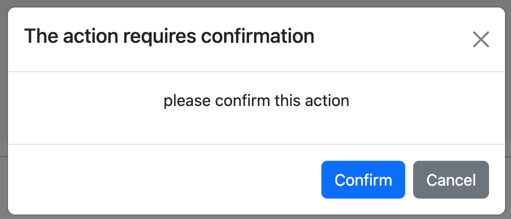

.. PowerButtons documentation master file, created by
   sphinx-quickstart on Thu Sep 28 13:12:42 2023.
   You can adapt this file completely to your liking, but it should at least
   contain the root `toctree` directive.

Welcome to PowerButtons's documentation!
========================================

**PowerButtons** is a library that adds additional functionality to buttons (or any other html component) in a web page. The idea is to simplify some tasks that we usually do in web pages, such as adding a confirmation dialog prior to submitting a form, or verifying that some condition is met prior to executing a function.

The most simple example is the next one:

.. code-block:: HTML

   <button data-confirm="Are you sure?">clickme</button>

And then the effect is that when the user clicks the button, a confirmation dialog will be shown, and if the user clicks *Confirm*, then the button will execute its action. If the user clicks *Cancel*, then the button will not continue its action.

The library also includes other type of buttons, such as *verify button*, *asynctask button*, *showmessage button*, *formset button*, *formbutton button*, etc. Please check the :ref:`button list` section for a complete list.

.. toctree::
   :maxdepth: 2
   :caption: Getting started:

   getting
   using
.. toctree::
   :maxdepth: 2
   :caption: Buttons:

   buttons

.. toctree::
   :maxdepth: 2
   :caption: Examples of use cases:

   advanced

.. toctree::
   :maxdepth: 2
   :caption: Extending the library:

   devel

.. Indices and tables
.. ==================

.. * :ref:`genindex`
.. * :ref:`modindex`
.. * :ref:`search`
